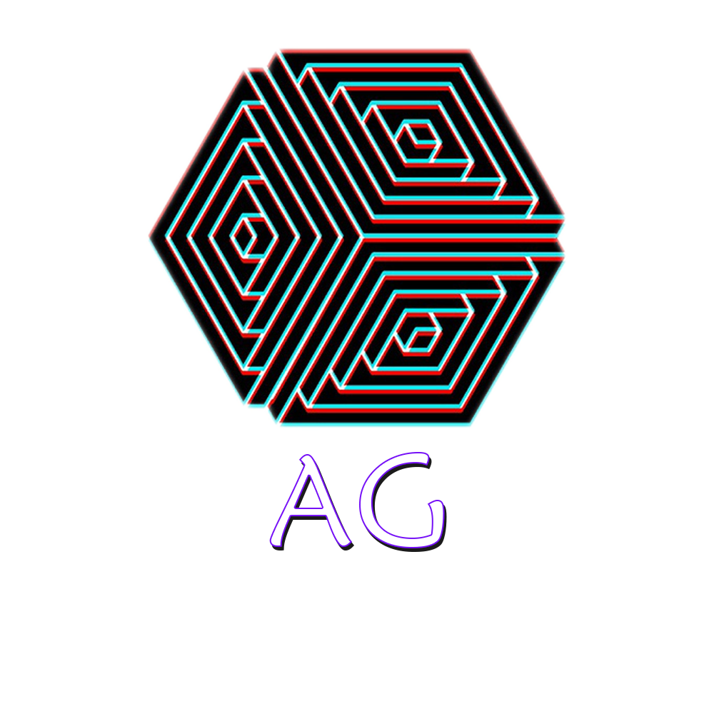
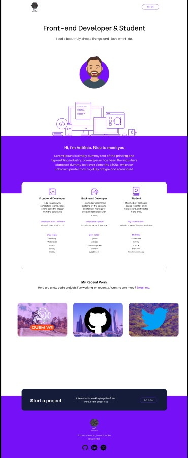

<p align="center">
  <a href="https://github.com/AntonioGally/Portfolio">
    
  </a>

  <h3 align="center">AG Portfolio</h3>

  <p align="center">
   My personal portfolio, made with the objective of promoting my work in the development area.
    <br />
    <a href="https://github.com/AntonioGally/Portfolio"><strong> Explore the docs »</strong></a>
    <br />
    <br />
    <a href="">View Demo</a>
    ·
    <a href="https://github.com/AntonioGally/Portfolio/issues">Report Bug</a>
    ·
  </p>
</p>
<!-- TABLE OF CONTENTS -->

## Table of Contents

- [About the Project](#about-the-project)
  - [Built With](#built-with)
- [Getting Started](#getting-started)
  - [Prerequisites](#prerequisites)
  - [Installation](#installation)
- [Contributing](#contributing)
- [Contact](#contact)
<!-- ABOUT THE PROJECT -->

## About The Project

<br/>


I made this portfolio because I needed a platform to post my future projects, I know there is GitHub, but this platform is more devoted to Devs. As for the portfolio design, I was inspired by several on the internet, and I did mine with some changes.

### Built With

Here is a list of the Frameworks and libraries that I used in the project

- [React](https://pt-br.reactjs.org)
- [Material-UI](https://material-ui.com/pt/)
- [React-Bootstrap](https://react-bootstrap.github.io)
- [Bootstrap](https://getbootstrap.com)
- [React-Hook-Form](https://react-hook-form.com)

<!-- GETTING STARTED -->

## Getting Started

To run the application locally on your machine, I recommend the VS Code editor. I leave here a list of prerequisites that are necessary for the execution of the project:

### Prerequisites

- <a href="https://git-scm.com/downloads">Git Bash</a>
- <a href="https://nodejs.org/en/download/">Node js</a>
- <a href="https://classic.yarnpkg.com/en/docs/install/#windows-stable">Yarn</a>

### Installation

1. Clone the repository

```sh
git clone https://github.com/AntonioGally/Portfolio.git
```

2. Open the cloned folder in Vs Code

```sh
code ./Portfolio
```

3. Install project dependencies

```sh
yarn install
```

4. Initialize the project

```sh
yarn start
```

<!-- CONTRIBUTING -->

## Contributing

Contributions are what make the open source community an incredible place to learn, inspire and create. Any contributions you make will be ** highly appreciated **.

1. Fork the project
2. Create your branch with new functionality (`git checkout -b feature/MyFunction`)
3. Commit yout changes (`git commit -m 'adding my functions'`)
4. Upload to your branch (`git push origin feature/MinhaFuncionalidade`)
5. Open a Pull Request

<!-- CONTACT -->

## Contact

Antônio Lima Gally Neto - antonio.gally@gmail.com

Link of the project: [here](https://github.com/AntonioGally/Portfolio)
